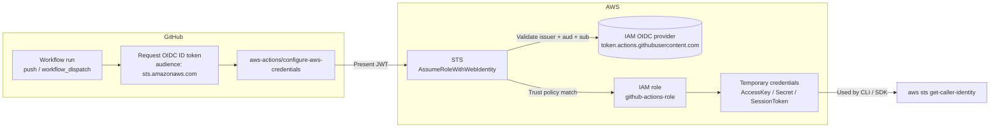
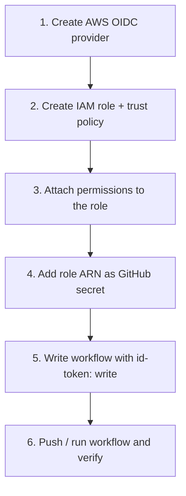
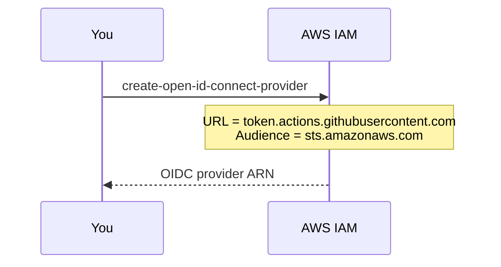
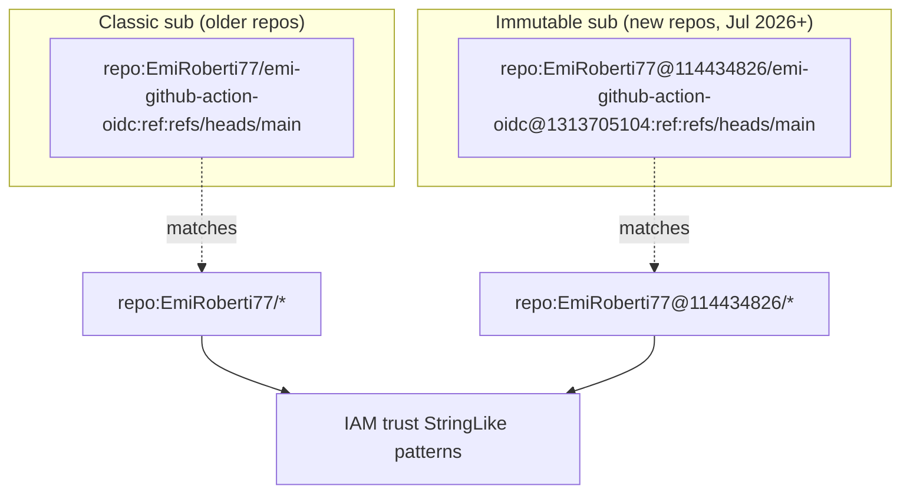
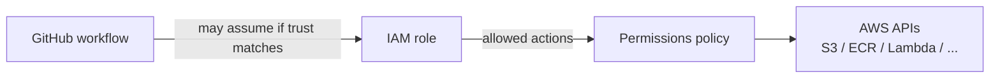
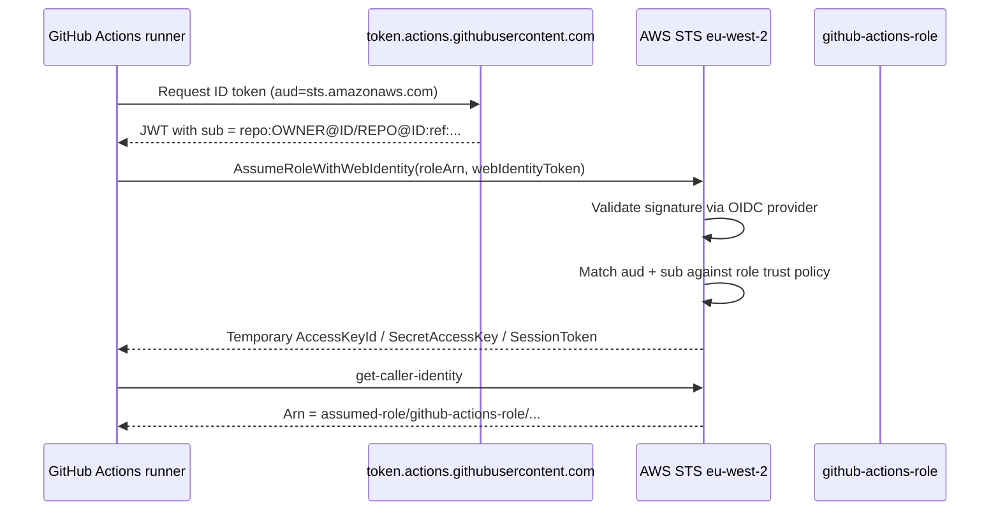
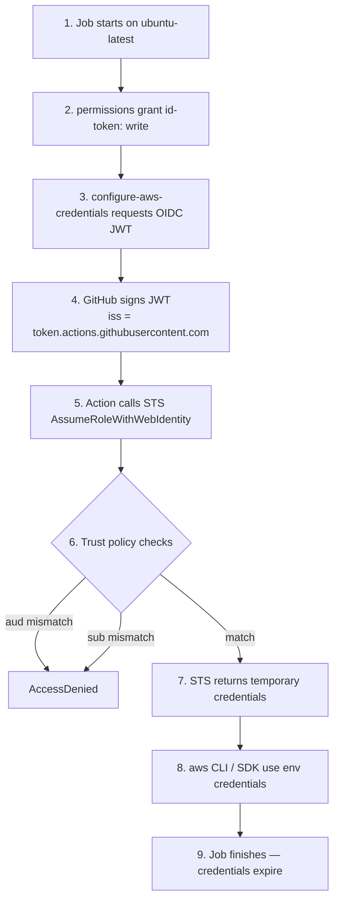

# GitHub Actions ↔ AWS OIDC

This project authenticates GitHub Actions to AWS with **OpenID Connect (OIDC)** — no long-lived access keys. The workflow assumes an IAM role using a short-lived token issued by GitHub.

> **Note:** The local project root folder name must match the GitHub repository name on `origin` (for example, folder `emi-github-action-oidc` ↔ `git@github.com:EmiRoberti77/emi-github-action-oidc.git`). Keep them the same when cloning or renaming so paths, docs, and trust-policy examples stay aligned with the remote.

## Architecture



### What each piece does

| Piece | Where | Purpose |
| --- | --- | --- |
| OIDC identity provider | AWS IAM | Tells AWS to trust tokens from `token.actions.githubusercontent.com` |
| IAM role + trust policy | AWS IAM | Allows GitHub workflows (matching `sub` / `aud`) to assume the role |
| `AWS_IAM_ROLE` secret | GitHub repo secrets | Stores the role ARN the workflow should assume |
| Workflow `permissions` | `.github/workflows/deploy.yml` | `id-token: write` lets the job request an OIDC token |
| `configure-aws-credentials` | Workflow step | Exchanges the GitHub JWT for temporary AWS credentials |

---

## End-to-end setup



---

## Step 1 — Create the GitHub OIDC provider in AWS

Do this **once per AWS account**.

### AWS Console

1. Open **IAM → Identity providers → Add provider**.
2. Provider type: **OpenID Connect**.
3. Provider URL:

   ```text
   https://token.actions.githubusercontent.com
   ```

4. Click **Get thumbprint** (AWS can also validate via its trust store).
5. Audience (client ID):

   ```text
   sts.amazonaws.com
   ```

6. Create the provider.

### AWS CLI

```bash
aws iam create-open-id-connect-provider \
  --url https://token.actions.githubusercontent.com \
  --client-id-list sts.amazonaws.com \
  --thumbprint-list ffffffffffffffffffffffffffffffffffffffff
```

> AWS can verify GitHub’s certificates via its trust store; the thumbprint is largely legacy. If the provider already exists you will get `EntityAlreadyExists` — that is fine.

### Verify

```bash
aws iam list-open-id-connect-providers
```

You should see:

```text
arn:aws:iam::<ACCOUNT_ID>:oidc-provider/token.actions.githubusercontent.com
```



---

## Step 2 — Create the IAM role and trust policy

### Important: GitHub `sub` claim formats (2026+)

Repos created **on or after 15 July 2026** (this repo included) receive an **immutable-ID** subject claim:

```text
repo:OWNER@OWNER_ID/REPO@REPO_ID:ref:refs/heads/main
```

Example from this project:

```text
repo:EmiRoberti77@114434826/emi-github-action-oidc@1313705104:ref:refs/heads/main
```

Older repos still use the classic form:

```text
repo:OWNER/REPO:ref:refs/heads/main
```

A trust policy that only allows `repo:OWNER/*` **will not match** the immutable form, because `@OWNER_ID` sits between the owner name and `/`. Trust **both** patterns.

Find your IDs:

```bash
# Numeric user / org ID
gh api users/EmiRoberti77 --jq .id
# → 114434826

# Numeric repository ID
gh api repos/EmiRoberti77/emi-github-action-oidc --jq .id
# → 1313705104

# Subject template GitHub will issue
gh api /repos/EmiRoberti77/emi-github-action-oidc/actions/oidc/customization/sub
```



### Trust policy used by this project

Save as `trust-policy.json` (replace `<ACCOUNT_ID>`):

```json
{
  "Version": "2012-10-17",
  "Statement": [
    {
      "Effect": "Allow",
      "Principal": {
        "Federated": "arn:aws:iam::<ACCOUNT_ID>:oidc-provider/token.actions.githubusercontent.com"
      },
      "Action": "sts:AssumeRoleWithWebIdentity",
      "Condition": {
        "StringEquals": {
          "token.actions.githubusercontent.com:aud": "sts.amazonaws.com"
        },
        "StringLike": {
          "token.actions.githubusercontent.com:sub": [
            "repo:EmiRoberti77/*",
            "repo:EmiRoberti77@114434826/*"
          ]
        }
      }
    }
  ]
}
```

| Condition | Why |
| --- | --- |
| `aud` = `sts.amazonaws.com` | Token must be intended for AWS STS |
| `sub` classic wildcard | Older repos / classic tokens |
| `sub` immutable wildcard | New repos with `@ownerId` / `@repoId` |
| `StringLike` (not `StringEquals`) | Required when using `*` wildcards |

### Create the role

```bash
aws iam create-role \
  --role-name github-actions-role \
  --assume-role-policy-document file://trust-policy.json \
  --description "Assumed by GitHub Actions via OIDC"

aws iam get-role --role-name github-actions-role \
  --query Role.Arn --output text
```

Example ARN for this account:

```text
arn:aws:iam::852373396798:role/github-actions-role
```

### Tighten later (recommended)

For production, prefer repo- and branch-scoped subjects:

```json
"token.actions.githubusercontent.com:sub": [
  "repo:EmiRoberti77/emi-github-action-oidc:ref:refs/heads/main",
  "repo:EmiRoberti77@114434826/emi-github-action-oidc@1313705104:ref:refs/heads/main"
]
```

---

## Step 3 — Attach permissions to the role

The trust policy only answers *who may assume*. Attach a permissions policy for *what they can do*.

This project currently uses `AdministratorAccess` for a connectivity test. Prefer least privilege for real workloads.

```bash
# Demo / test only
aws iam attach-role-policy \
  --role-name github-actions-role \
  --policy-arn arn:aws:iam::aws:policy/AdministratorAccess
```

Example least-privilege alternative (S3 deploy only):

```json
{
  "Version": "2012-10-17",
  "Statement": [
    {
      "Effect": "Allow",
      "Action": ["s3:PutObject", "s3:GetObject", "s3:ListBucket"],
      "Resource": [
        "arn:aws:s3:::my-bucket",
        "arn:aws:s3:::my-bucket/*"
      ]
    }
  ]
}
```



---

## Step 4 — Store the role ARN in GitHub

1. Open the repo → **Settings → Secrets and variables → Actions**.
2. Create a repository secret:

| Name | Value |
| --- | --- |
| `AWS_IAM_ROLE` | `arn:aws:iam::<ACCOUNT_ID>:role/github-actions-role` |

CLI:

```bash
gh secret set AWS_IAM_ROLE \
  --body "arn:aws:iam::852373396798:role/github-actions-role" \
  --repo EmiRoberti77/emi-github-action-oidc
```

Do **not** commit the ARN with credentials; the role ARN itself is not a secret key, but keeping it in Actions secrets matches this project’s workflow.

---

## Step 5 — Workflow configuration

File: [`.github/workflows/deploy.yml`](.github/workflows/deploy.yml)

```yaml
name: EmiDeployTest

on:
  push:
    branches: [main]
  workflow_dispatch:

permissions:
  id-token: write   # required to request the OIDC JWT
  contents: read    # required to checkout the repo

jobs:
  test:
    runs-on: ubuntu-latest
    steps:
      - name: Checkout Source
        uses: actions/checkout@v4

      - name: Configure AWS credentials
        uses: aws-actions/configure-aws-credentials@v6
        with:
          role-to-assume: ${{ secrets.AWS_IAM_ROLE }}
          aws-region: eu-west-2

      - name: Test AWS credentials
        run: aws sts get-caller-identity
```

### Why these settings matter

| Setting | Required? | Notes |
| --- | --- | --- |
| `permissions.id-token: write` | **Yes** | Without it, no OIDC token is minted |
| `permissions.contents: read` | Yes for checkout | Default can be too restrictive when you set explicit `permissions` |
| `role-to-assume` | **Yes** | Full ARN of `github-actions-role` |
| `aws-region` | **Yes** | This project uses `eu-west-2` |
| Action `@v6` (or newer) | Recommended | Avoids Node 20 deprecation warnings on GitHub-hosted runners |



---

## Step 6 — Run and verify

```bash
# Trigger manually
gh workflow run EmiDeployTest --repo EmiRoberti77/emi-github-action-oidc

# Or push to main
git push origin main

# Watch the run
gh run list --workflow=EmiDeployTest --limit 3
gh run watch
```

A successful **Configure AWS credentials** / **Test AWS credentials** step prints something like:

```json
{
  "UserId": "AROA...:GitHubActions",
  "Account": "852373396798",
  "Arn": "arn:aws:sts::852373396798:assumed-role/github-actions-role/GitHubActions"
}
```

---

## Runtime flow (summary)



---

## Troubleshooting

### `Not authorized to perform sts:AssumeRoleWithWebIdentity`

Almost always a **trust policy `sub` / `aud` mismatch**.

1. Confirm workflow has `permissions: id-token: write`.
2. Confirm secret `AWS_IAM_ROLE` is the correct role ARN.
3. Read the rejected subject from CloudTrail (region = workflow `aws-region`):

```bash
aws cloudtrail lookup-events \
  --region eu-west-2 \
  --lookup-attributes AttributeKey=EventName,AttributeValue=AssumeRoleWithWebIdentity \
  --max-results 5 \
  --query 'Events[0].CloudTrailEvent' \
  --output text | jq -r '.userIdentity.userName'
```

4. Compare that `userName` (the `sub`) to your trust policy `StringLike` patterns character-by-character.
5. If you see `repo:Owner@123/...`, add an immutable pattern such as `repo:Owner@123/*`.

### Node 20 deprecation warning

```text
Node 20 is being deprecated. This workflow is running with Node 24 by default...
```

This is a **warning**, not the auth failure. Pin a current major of the credentials action (`@v6` or later) instead of an old commit SHA that still runs on Node 20.

### Other common mistakes

| Symptom | Likely cause |
| --- | --- |
| `No OpenIDConnect provider found` | OIDC provider missing in that AWS account |
| Works in old repo, fails in new repo | Immutable `sub` format — update trust policy |
| Job uses `environment:` and fails | `sub` becomes `...:environment:NAME` — allow that pattern |
| Wildcard under `StringEquals` never matches | Move wildcards to `StringLike` |

---

## Project checklist

- [x] AWS OIDC provider: `token.actions.githubusercontent.com`
- [x] Audience: `sts.amazonaws.com`
- [x] IAM role: `github-actions-role`
- [x] Trust policy allows classic **and** immutable `sub` patterns
- [x] GitHub secret: `AWS_IAM_ROLE`
- [x] Workflow: `id-token: write` + `configure-aws-credentials@v6`
- [x] Region: `eu-west-2`
- [x] Smoke test: `aws sts get-caller-identity`

---

## References

- [GitHub: Configuring OpenID Connect in Amazon Web Services](https://docs.github.com/en/actions/how-tos/secure-your-work/security-harden-deployments/oidc-in-aws)
- [aws-actions/configure-aws-credentials](https://github.com/aws-actions/configure-aws-credentials)
- [GitHub changelog: Node 20 deprecation on Actions runners](https://github.blog/changelog/2025-09-19-deprecation-of-node-20-on-github-actions-runners/)
- [GitHub: About security hardening with OpenID Connect](https://docs.github.com/en/actions/security-for-github-actions/security-hardening-your-deployments/about-security-hardening-with-openid-connect)
